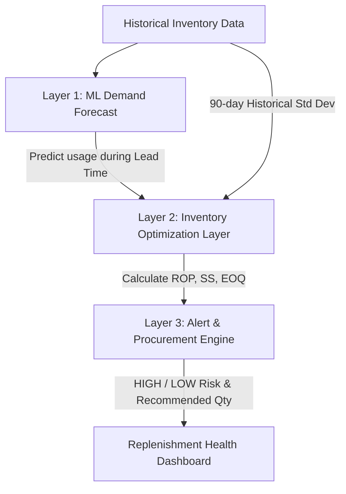

# Inventory Optimization and Material Planning System
### CodeSprint 2026 National Level Hackathon — Problem Statement #167
**Team ID / Code:** CS2026-756  
**Industry:** Manufacturing  
**Target:** Audisankara Deemed to be University, Gudur, AP, India

---

## 📌 Executive Summary

Manufacturing SMEs struggle with inventory management due to inefficient, static systems that cause high costs from overstocking or production halts during stockouts. The AI model solves this by utilizing a three-layer pipeline: predicting demand through machine learning, optimizing stock levels via mathematical formulas, and issuing precise, automated procurement alerts to prevent shortages and reduce costs.

---

## 🏗️ System Architecture: The Three-Layer Pipeline

Our solution replaces standard static replenishment rules (like fixed monthly orders) with an intelligent, dynamic continuous-review system.



---

## 🔄 Detailed Flows: Inputs, Outputs, and "Why"

### 1. Data Generation & Feature Engineering Flow
* **Inputs:** Base demand, weekly & yearly sinusoidal seasonality constants, random demand shock multipliers (1.8x to 3x), supply chain disruption delays (4 to 10 days).
* **Outputs:** 
  - `inventory_data.csv`: Daily log of `[date, material_id, units_used, current_stock]`.
  - `material_metadata.json`: Key material invariants like lead time and base demand.
* **Why this flow exists:** In manufacturing, demand is subject to seasonality, shocks (promotional spikes), and logistics disruptions (supply delays). Simulating these challenges ensures that the downstream forecasting models and replenishment systems are robust against real-world volatility.

---

### 2. Layer 1: Machine Learning Demand Forecasting Flow
* **Inputs:** 
  - **Lags (t-1, t-7, t-14, t-30):** Capture recent demand levels.
  - **Rolling statistics (Mean 7/30 days, Std Dev 7 days):** Capture recent consumption velocity and volatility.
  - **Temporal features (Day of week, Month):** Allow the model to capture weekly and monthly cyclic variations.
* **Outputs:** A multi-step recursive forecast of `units_used` for the next $L$ days, where $L = \text{lead\_time\_days}$ of the material.
* **Why this flow exists:** 
  - *Autoregressive features* are used because recent usage is the strongest predictor of tomorrow's usage.
  - *Recursive forecasting* is used because if a material has a lead time of 7 days, an order placed today will not arrive for 7 days. We must predict the cumulative consumption over the entire lead time window to know if our current stock can sustain operations until the order arrives.

---

### 3. Layer 2: Mathematical Stock Optimization Flow
* **Inputs:**
  - **Forecasted usage sequence** (from Layer 1).
  - **Historical usage (last 90 days)** of training data.
  - **Replenishment lead time** ($L$ days).
  - **Holding cost ($H$) and Order cost ($S$)** (parameters representing storage fees and procurement costs).
* **Outputs:**
  - **Safety Stock ($SS$):** The buffer inventory required to protect against demand spikes and delivery delays.
    $$SS = z \times \sigma_{90} \times \sqrt{L}$$
    *(where $z = 1.645$ for a 95% service level, and $\sigma_{90}$ is the standard deviation of daily demand over the last 90 days).*
  - **Reorder Point ($ROP$):** The inventory level that triggers a replenishment order.
    $$ROP = (\text{Mean Forecasted Daily Usage} \times L) + SS$$
  - **Economic Order Quantity ($EOQ$):** The ideal order size to minimize total inventory costs.
    $$EOQ = \sqrt{\frac{2 \times (\text{Mean Forecasted Daily Usage} \times 365) \times S}{H}}$$
* **Why this flow exists:**
  - *Safety Stock* uses the last 90 days of actual demand history (rather than future forecasts) because historical data provides a stable, long-term picture of real-world demand variance, preventing safety stock from fluctuating erratically based on temporary forecast anomalies.
  - *EOQ* balances the trade-off between ordering too frequently (high transaction costs) and holding too much stock (high storage and capital tying costs).

---

### 4. Layer 3: Alerting and Procurement Logic Flow
* **Inputs:**
  - **Current stock level** (at the close of the day).
  - **Reorder Point ($ROP$)** (from Layer 2).
  - **Economic Order Quantity ($EOQ$)** (from Layer 2).
* **Outputs:**
  - **Stockout Risk:** `"HIGH"` if $\text{Current Stock} < ROP$, else `"LOW"`.
  - **Recommended Order Quantity:** $\text{EOQ}$ if risk is `"HIGH"`, else $0$.
* **Why this flow exists:** This is the operational decision-making engine. Setting the stockout risk to `"HIGH"` the moment stock drops below the $ROP$ gives the procurement team an early-warning signal exactly $L$ days before they would run out of materials, ensuring replenishment arrives just in time.

---

## 🚀 How to Run the App & Backend Workflow

Ensure you have the dependencies installed:
```bash
pip install -r requirements.txt
```

### Step 1: Generate Synthetic Material History
Simulates 2 years of daily data for 15 raw materials, including custom shock events and delayed lead times:
```bash
python -m core.generate_data
```

### Step 2: Train Machine Learning Models
Trains 15 independent `GradientBoostingRegressor` models, outputs test set MAE, and saves models to `/models/`:
```bash
python -m core.baseline_model
```

### Step 3: Run the Backend Flask API Server
Start the Flask REST API server to serve the API and the Swagger UI:
```bash
python app.py
```
*The server will run on `http://127.0.0.1:5000`.*

---

## 📡 API Endpoints

### 1. Interactive Dashboard (Web UI)
* **Endpoint:** `GET /`
* **Description:** Renders the Swagger UI API documentation and tester client.

### 2. Health Check
* **Endpoint:** `GET /api/health`
* **Response:**
  ```json
  {"status": "ok", "timestamp": "2026-08-08T09:14:53.621588"}
  ```

### 3. Retrieve Materials Config & Logs
* **Endpoint:** `GET /api/inventory/materials`
* **Response (JSON list of material stats):**
  ```json
  [
    {
      "material_id": "MAT_01",
      "current_stock": 3788,
      "lead_time_days": 7,
      "historical_usage_90": [292, 278, 172, ... (90 items)]
    }
  ]
  ```

### 4. Inventory Optimization Recommendation
* **Endpoint:** `POST /api/inventory/optimize`
* **Payload (JSON):**
  ```json
  {
    "material_id": "MAT_01",
    "current_stock": 379.0,
    "lead_time_days": 7,
    "historical_usage_90": [400.0, 410.0, 390.0, ... (90 daily floats)]
  }
  ```
* **Response (JSON):**
  ```json
  {
    "material_id": "MAT_01",
    "current_stock": 379,
    "safety_stock": 120,
    "reorder_point": 2786,
    "eoq": 2636,
    "recommended_order_qty": 2636,
    "stockout_risk": "HIGH",
    "forecasted_usage": [372.88, 366.01, 391.8, 392.72, 387.07, 380.59, 375.04]
  }
  ```

---

## 📁 Repository Structure

```text
├── app.py                  # Flask application entry point
├── requirements.txt        # Python backend dependencies
├── inventory_data.csv      # Simulated daily usage & stock records
├── material_metadata.json     # Raw material attributes (lead times, etc.)
├── models/                 # Saved GBDT models per material (*_baseline.pkl)
├── templates/
│   └── index.html          # Swagger UI HTML template
├── api/
│   ├── __init__.py
│   ├── inventory.py        # API routes and blueprint handlers
│   └── schemas.py          # Marshmallow request schemas
└── core/
    ├── __init__.py
    ├── generate_data.py    # Data simulation & metadata creation
    ├── baseline_model.py   # Feature engineering & ML training script
    ├── inventory_logic.py  # Math formulations (SS, ROP, EOQ, Risk)
    ├── pipeline.py         # Pipeline runner & terminal dashboard
    └── test_interactive.py # Quick local intuition test runner
```

---

## ⚡ Backend Integration Guide

For additional technical details on integrating the ML forecasting models and mathematical inventory logic into your web application backend, refer to the **[backend.md](file:///home/shaikafnan/cs756/backend.md)** document.
