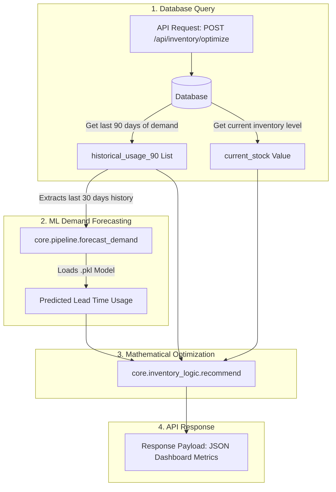

# Inventory Optimization Engine: Backend Integration Guide

This guide details the directory structure, file locations, function maps, and integration workflows for the backend team based on the structured Flask implementation.

---

## 📁 Directory Structure & Function Map

Below is the directory map of the project showing the exact module files and the functions they contain.

| File Path | Function Name | Purpose | When to Call |
| :--- | :--- | :--- | :--- |
| [inventory_logic.py](file:///home/shaikafnan/cs756/core/inventory_logic.py) | `recommend()` | Calculates safety stock, ROP, EOQ, and stockout risk alert. | Every time the inventory dashboard page loads or refreshes. |
| [pipeline.py](file:///home/shaikafnan/cs756/core/pipeline.py) | `forecast_demand()` | Generates a multi-step future demand projection using GBDT models. | To predict lead-time usage (pre-requisite for `recommend()`). |
| [pipeline.py](file:///home/shaikafnan/cs756/core/pipeline.py) | `simulate_shortage()` | Adjusts stock levels to 10% to test stockout alerts. | During demo/testing to trigger "HIGH" risk states. |
| [baseline_model.py](file:///home/shaikafnan/cs756/core/baseline_model.py) | `train_baseline_models()` | Re-trains models on fresh transaction logs. | Periodic cron/background task (e.g. weekly or monthly). |
| [generate_data.py](file:///home/shaikafnan/cs756/core/generate_data.py) | `generate_synthetic_data()` | Creates dummy historical logs for ERP database seeding. | Initial project setup / testing environment configuration. |

---

## 🔄 Backend Integration Workflow

During live app operation, the data flows between your database (SQL/NoSQL), the forecasting model, the mathematical optimizer, and finally to your Flask API controller.



---

## 🛠️ Code Specifications & API Schemas

### 1. Demand Forecaster
* **File Location:** [core/pipeline.py](file:///home/shaikafnan/cs756/core/pipeline.py)
* **Function Signature:**
  ```python
  def forecast_demand(
      material_id: str, 
      historical_usage_30: list[float], 
      lead_time_days: int, 
      models_dir: str = "models", 
      reference_date: datetime = None
  ) -> list[float]
  ```

### 2. Inventory Optimization Calculator
* **File Location:** [core/inventory_logic.py](file:///home/shaikafnan/cs756/core/inventory_logic.py)
* **Function Signature:**
  ```python
  def recommend(
      material_id: str,
      current_stock: float,
      forecasted_usage: list[float],
      lead_time_days: int,
      historical_usage_90: list[float],
      order_cost: float = 50.0,
      holding_cost_per_unit: float = 2.0
  ) -> dict
  ```

---

## ⚡ Flask Controller & Schema Implementation

Your backend uses **Flask** and **Marshmallow** for payload validation. Here is the exact codebase structure implemented:

### Request Validation Schema (`api/schemas.py`)
```python
from marshmallow import Schema, fields, validate

class OptimizationRequestSchema(Schema):
    material_id = fields.Str(required=True)
    current_stock = fields.Float(required=True)
    lead_time_days = fields.Int(required=True, validate=validate.Range(min=1))
    historical_usage_90 = fields.List(fields.Float(), required=True)
    order_cost = fields.Float(load_default=50.0)
    holding_cost_per_unit = fields.Float(load_default=2.0)
```

### Route Handler Controller (`api/inventory.py`)
```python
import logging
from datetime import datetime
from flask import Blueprint, request, jsonify
from marshmallow import ValidationError

# Import using core package structures
from core.pipeline import forecast_demand
from core.inventory_logic import recommend
from api.schemas import OptimizationRequestSchema

inventory_bp = Blueprint("inventory", __name__, url_prefix="/api")
_schema = OptimizationRequestSchema()
logger = logging.getLogger(__name__)

@inventory_bp.post("/inventory/optimize")
def optimize():
    try:
        payload = _schema.load(request.get_json(force=True) or {})
    except ValidationError as exc:
        return jsonify({"error": exc.messages}), 400

    if len(payload["historical_usage_90"]) < 90:
        return jsonify({
            "error": "Minimum 90 days of usage history is required for safety stock calculations."
        }), 400

    material_id = payload["material_id"]
    historical_usage_30 = payload["historical_usage_90"][-30:]

    try:
        # 1. Run Demand Forecasting
        forecast = forecast_demand(
            material_id=material_id,
            historical_usage_30=historical_usage_30,
            lead_time_days=payload["lead_time_days"],
            models_dir="models",
            reference_date=datetime.now(),
        )

        # 2. Run Stock Level Calculations
        result = recommend(
            material_id=material_id,
            current_stock=payload["current_stock"],
            forecasted_usage=forecast,
            lead_time_days=payload["lead_time_days"],
            historical_usage_90=payload["historical_usage_90"],
            order_cost=payload["order_cost"],
            holding_cost_per_unit=payload["holding_cost_per_unit"],
        )

        result["forecasted_usage"] = [round(v, 2) for v in forecast]
        return jsonify(result), 200

    except FileNotFoundError:
        return jsonify({
            "error": f"Forecasting model for material '{material_id}' was not found. Please train models first."
        }), 404
    except Exception as exc:
        return jsonify({"error": str(exc)}), 500
```
